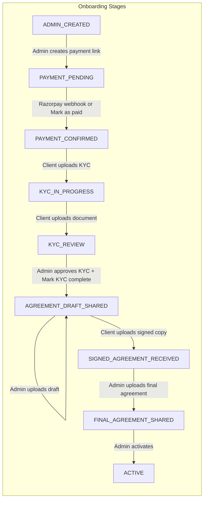

# Onboarding Timeline – Client and Admin Dashboards

This document describes the onboarding stages, what happens at each stage, and what the client and admin see and can do in their respective dashboards.

---

## 1. ADMIN_CREATED

**What happens:** Admin creates a new client company (via Companies → New Company). The system creates the ClientProfile and sends a set-password invite email to the client.

**Client dashboard:**
- Stepper shows "Registration Created" (Step 0).
- Status badge: Pending or Inactive.
- Action hint: "Registration created; payment pending."
- Next Action Card: Generic "Onboarding in progress" message.
- Client can view Dashboard, Documents (empty), Profile, Payments, Invoices.

**Admin dashboard:**
- Company appears in the list with stage "Admin created".
- Admin opens company detail page.
- Admin can: Create Payment Link, Resend Invite, Delete Company (ADMIN role only).

---

## 2. PAYMENT_PENDING

**What happens:** Admin generates a payment link (Create Payment). The system creates a Payment record (status CREATED), updates the company stage to PAYMENT_PENDING, and sends a payment link email to the client.

**Client dashboard:**
- Stepper shows "Awaiting Payment" (Step 1).
- Status badge: Pending.
- Action hint: "Waiting for client payment."
- **Next Action Card:** "Complete Your Payment" with a "Pay Now" button that opens the Razorpay payment link in a new tab.
- Client clicks Pay Now → Razorpay checkout → pays.

**Admin dashboard:**
- Stage: "Payment pending".
- Payment section shows the payment link; admin can copy it or resend the payment link email.
- Admin can manually "Mark as Paid" if webhook did not fire (Razorpay captured but webhook failed).

---

## 3. PAYMENT_CONFIRMED → KYC_IN_PROGRESS

**What happens:** When payment is captured:
- Razorpay webhook (`payment.captured`, `payment_link.paid`, etc.) hits `/webhooks/razorpay`.
- Backend marks payment PAID, moves stage PAYMENT_PENDING → PAYMENT_CONFIRMED → KYC_IN_PROGRESS.
- Invoice is generated (GST PDF) and emailed to the client.

**Client dashboard:**
- Stepper moves to "Payment Completed" then "Upload KYC Documents" (Steps 1 → 2).
- Action hint: "Payment completed; next: KYC documents."
- **Next Action Card:** "Upload Your KYC Documents" with "Upload Documents" button linking to `/client/documents`.
- Client must upload Aadhaar and PAN (KYC document types).

**Admin dashboard:**
- Stage: "KYC in progress".
- Payment section shows paid payment and invoice.
- Documents section shows KYC documents once client uploads.

---

## 4. KYC_IN_PROGRESS

**What happens:** Client uploads KYC documents. Each upload:
- Calls `onKycUploaded` and `moveToKycReviewAfterUpload` in documents service.
- Stage remains KYC_IN_PROGRESS until at least one document is uploaded, then moves to KYC_REVIEW.

**Client dashboard:**
- Stepper: "Upload KYC Documents" or "KYC Under Review" (Step 2).
- Action hint: "Client must upload documents" or "Under admin review."
- **Next Action Card:** "Upload Your KYC Documents" → Documents page.
- Client uploads Aadhaar, PAN, or other KYC docs.

**Admin dashboard:**
- Stage: "KYC in progress" or "KYC review".
- Documents table: Admin can View, Download, Approve, Reject, or "Pending with client" on each document.

---

## 5. KYC_REVIEW

**What happens:** Client has uploaded at least one KYC document. Admin reviews and either approves, rejects, or sends back to client. When all KYC docs are approved and admin clicks "Mark KYC Complete":
- Admin calls `PATCH /client-profiles/:id/status` with `stage: AGREEMENT_DRAFT_SHARED`.
- Stage moves to AGREEMENT_DRAFT_SHARED.

**Client dashboard:**
- Stepper: "KYC Under Review" (Step 2).
- Action hint: "Admin review required."
- **Next Action Card:** "Documents Under Review" (informational; no button).
- Client waits; if rejected or "Pending with client", client must re-upload or provide better documents.

**Admin dashboard:**
- Stage: "KYC review".
- Documents: Approve / Reject / Pending with client.
- **"Mark KYC Complete"** button (enabled when compliance is satisfied) → moves to AGREEMENT_DRAFT_SHARED.

---

## 6. AGREEMENT_DRAFT_SHARED

**What happens:** Admin marks KYC complete, then uploads the agreement draft document (type AGREEMENT_DRAFT, owner ADMIN). The upload automatically sets stage to AGREEMENT_DRAFT_SHARED (idempotent if already there). Client receives the draft and must sign it and upload the signed copy.

**Client dashboard:**
- Stepper: "Agreement Draft Shared" (Step 3).
- Action hint: "Client must sign agreement."
- **Next Action Card:** "Review and Sign Your Agreement" with "Download Draft" or "View Documents" linking to Documents.
- Client downloads draft, signs it, uploads signed copy (type AGREEMENT_SIGNED).

**Admin dashboard:**
- Stage: "Agreement draft shared".
- Documents: Agreement draft visible. Admin waits for client to upload signed agreement.

---

## 7. SIGNED_AGREEMENT_RECEIVED

**What happens:** Client uploads the signed agreement (AGREEMENT_SIGNED type). The documents service calls `confirmSignedAgreement` after upload, which moves stage to SIGNED_AGREEMENT_RECEIVED.

**Client dashboard:**
- Stepper: "Signed Agreement Received" (Step 4).
- Action hint: (None specific in hints; handled by Next Action.)
- **Next Action Card:** "Waiting for Final Agreement" (informational).
- Client waits for admin to upload final stamped agreement.

**Admin dashboard:**
- Stage: "Signed agreement received".
- Admin uploads the final agreement (AGREEMENT_FINAL, owner ADMIN). This is allowed only when stage is SIGNED_AGREEMENT_RECEIVED.
- Upload triggers `onFinalAgreementShared` → stage moves to FINAL_AGREEMENT_SHARED.

---

## 8. FINAL_AGREEMENT_SHARED

**What happens:** Admin has uploaded the final stamped agreement. Activation conditions are checked: payment PAID, all KYC approved, at least one AGREEMENT_FINAL. Admin clicks "Activate Company" to complete onboarding.

**Client dashboard:**
- Stepper: "Final Agreement Ready" (Step 5).
- Action hint: "Ready for activation."
- **Next Action Card:** "Final Agreement Ready" with "Download Final Agreement" or "View Documents".
- Client can download the final agreement.

**Admin dashboard:**
- Stage: "Final agreement shared".
- **"Activate Company"** button (enabled when stage is FINAL_AGREEMENT_SHARED).
- Admin clicks Activate → stage moves to ACTIVE, activationDate is set, activation email sent.

---

## 9. ACTIVE / COMPLETED

**What happens:** Company is fully onboarded. Onboarding is locked; no further document uploads or stage changes.

**Client dashboard:**
- Stepper: "Account Activated" (Step 6) – full green checkmarks.
- Status badge: Active.
- Action hint: "Onboarding complete."
- **Next Action Card:** "Your Workspace Access is Active" with "View Documents".
- Success banner: "Your account is active and ready".
- Client has full access: Documents, Payments, Invoices, Profile, Renewal info.

**Admin dashboard:**
- Stage: "Active" or "Completed".
- Company is in "Active Clients" bucket.
- No further onboarding actions; renewal management applies.

---

## 10. REJECTED

**What happens:** Admin can reject at various stages (e.g., KYC rejected, application rejected). Stage becomes REJECTED.

**Client dashboard:**
- Stepper: Shows REJECTED state (step index -1).
- Action hint: "Application was rejected."
- Client may need to re-upload documents or reapply depending on business process.

**Admin dashboard:**
- Stage: "Rejected".
- Admin can move back to PENDING_DOCUMENTS or other stages via status update if allowed by transitions.

---

## Stage Transition Summary

| From Stage | Trigger | To Stage |
|------------|---------|---------|
| ADMIN_CREATED | Admin creates payment link | PAYMENT_PENDING |
| PAYMENT_PENDING | Razorpay webhook or Admin marks paid | PAYMENT_CONFIRMED → KYC_IN_PROGRESS |
| PAYMENT_CONFIRMED | (automatic in webhook) | KYC_IN_PROGRESS |
| KYC_IN_PROGRESS | Client uploads KYC document | KYC_REVIEW |
| KYC_REVIEW | Admin approves all KYC + "Mark KYC Complete" | AGREEMENT_DRAFT_SHARED |
| AGREEMENT_DRAFT_SHARED | Admin uploads agreement draft | (stays or idempotent) |
| AGREEMENT_DRAFT_SHARED | Client uploads signed agreement | SIGNED_AGREEMENT_RECEIVED |
| SIGNED_AGREEMENT_RECEIVED | Admin uploads final agreement | FINAL_AGREEMENT_SHARED |
| FINAL_AGREEMENT_SHARED | Admin clicks "Activate Company" | ACTIVE |

---

## Dashboard Components

### Client Dashboard (Dashboard.tsx)

- **OnboardingStepper**: Visual progress with 7 steps, percentage complete.
- **NextActionCard**: Contextual action (Pay Now, Upload Documents, Download Draft, etc.).
- **SummaryCards**: Stage-specific summary (documents, payments, invoices).
- **TimelineView**: "Your Onboarding Timeline" – list of completed/current steps.
- **NotificationStrip**: Alerts for rejected docs, pending actions.
- **Quick Links**: Payments, Invoices, Documents, Profile.

### Admin Company Detail (AdminCompanyDetail.tsx)

- **OnboardingStepper**: Same visual as client (read-only).
- **Payment section**: Create payment link, copy link, resend link, mark as paid.
- **Documents section**: View/Download/Approve/Reject/Pending with client.
- **Agreement draft upload**: Multi-file upload when stage is KYC_REVIEW or AGREEMENT_DRAFT_SHARED.
- **Final agreement upload**: Single file when stage is SIGNED_AGREEMENT_RECEIVED.
- **Mark KYC Complete**: When KYC_REVIEW and compliant.
- **Activate Company**: When FINAL_AGREEMENT_SHARED.
- **Delete Company**: ADMIN role only.
